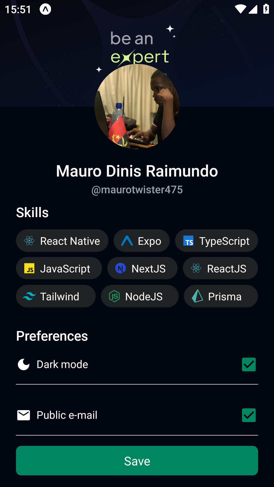

# Perfil Pessoal Mobile

- Esse foi um projecto simples, o meu próprio perfil na versão mobile.

   

## Tecnologias usadas

  - `React Native`
  - `Expo`

## Como Rodar localmente

 Para rodar o projecto localmente, primeiramente faça o download ou clone o seguinte repositório: https://github.com/MauroTwister475/my-profile

### Android

```sh
npx expo start
```
### iOS

```sh
npx expo start
```


## Ver mais sobre mim

- Github: https://github.com/MauroTwister475/profile
- Linkedin: https://www.linkedin.com/in/mauro-dinis-raimundo-00475526a/
